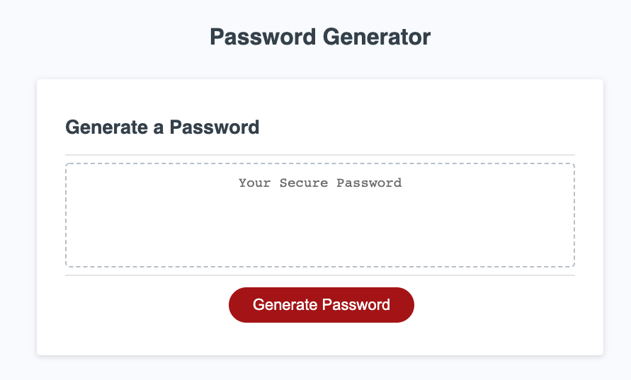

# Password Generator 

## Purpose
Randomly generate a password that meets criteria selected by user. User input is: length and if they want to use lowercase, uppercase, numeric and/or special characters.

## Built with
*HTML
*CSS
*JS

## Screenshot

## Website
https://theresarutledge.github.io/password-generator/
